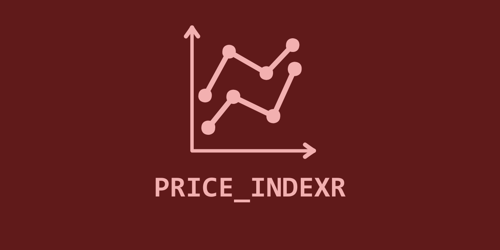

   

Keep track of the prices for a large series of products and enable yourself to take advantage of this data!

# This branch: `Central` 

Features added to this branch:

- Targeted for collecting Graphics Cards prices
- Centralizes the prices for all different products in a single SQLite database
- Now it's much easier to schedule for the price collection of multiple products
- Filtering is simpler

### How can this help me?

This can be used to satisfy business and personal necessities, for monitoring your competitor's prices, help on calculating price indexes for specific types of products or monitoring the price of a product you want to buy.

# Requirements

1. Python [version 3.12 or superior](https://www.python.org/downloads/) (Recommended to tick the option "Add python to PATH" if you are on Windows)
2. Packages listed in [requirements.txt](https://github.com/VFLins/Price_indexr/blob/central/requirements.txt)

To install the requirements, follow these steps:

1. Open this project folder and right-click an empty space
2. Click "Open on Terminal" or "Open PowerShell Window here"
3. Type the following lines of code, press enter at the end of each one, and wait the installation to complete in every step:

```
python.exe -m pip install --upgrade pip
pip install --upgrade wheel
pip install --upgrade setuptools
pip install -r requirements.txt
```

# How to use?

This version is intended to be used from [interface.py](https://github.com/VFLins/Price_indexr/blob/central/interface.py), this is a TUI (Text User Interface), where you can add new products to keep track of.

To accommodate the initial need to obtain prices for GPUs from many different models and manufacturers, the products are organized into a two-level hierarchy.

1. In the **higher level** are the "product names", originally used to store the chip names
2. In the **lower level** are the "brand", "model" and "filters"
   - `Filters` are used to mark words that should not appear on the targeted product title
      - Hardcoded filters are added to reduce typing time
      - Should be separated by commas (,)
      - For single filters with multiple words, the words should be separated by underscore (_)
   - Every word in `Brand`, `Model` and `Product Name` are required to appear in the result title in order for the price to be collected
  
### To add a product for monitoring:

Simply double-click `interface.py`, open with a python interpreter, and follow the instructions on the screen. Make sure you have all the [requirements](#requirements) installed before opening `interface.py`.

### To automate the weekly price data collection:

Set `scheduler.pyw` to be executed when your system starts, and set a python interpreter to be the default program to run this file extension. For instructions on how to do this on Windows, follow [this guide](https://support.microsoft.com/en-us/windows/add-an-app-to-run-automatically-at-startup-in-windows-10-150da165-dcd9-7230-517b-cf3c295d89dd#:~:text=Add%20an%20App%20to%20Run%20Automatically%20at%20Startup,file%20location%20to%20the%20Startup%20folder.%20See%20More.) and [this other guide](https://support.microsoft.com/en-us/windows/change-default-programs-in-windows-e5d82cad-17d1-c53b-3505-f10a32e1894d) respectively.

### To access your collected data:

Inside the same folder that `price_indexr.py` is located, look for a folder named *data*, there you might find a `database.db` file. This is a sqlite database, you can use [SQLite Studio](https://sqlitestudio.pl/) to browse your dataset.

### [New!] Collect prices on demand:

Just use `interface.py` and follow the instructions on the screen, you can collect prices for a specific product or for groups of products.

# See also:

- [Prind_Monitor:](https://github.com/VFLins/Prind_Monitor) Report generator for price data obtained by this piece of software, only compatible with SQLite databases for now. 
